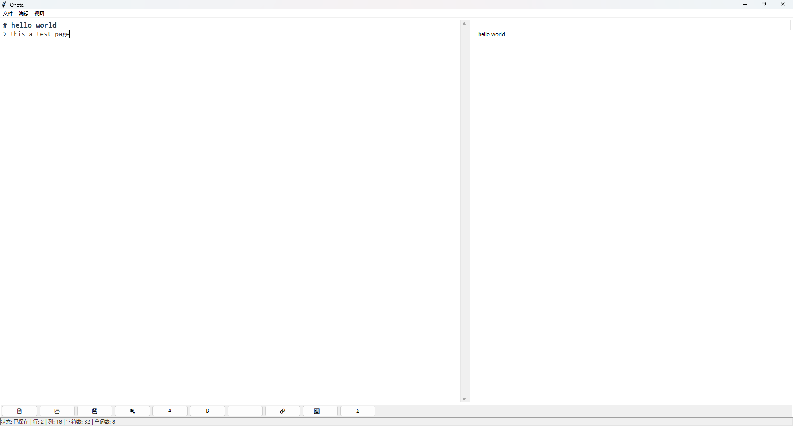

# Qnote - 轻量级Markdown编辑器

 

Qnote 是一个基于 Python Tkinter 开发的现代化 Markdown 编辑器，支持实时预览、语法高亮和多种实用功能，适合日常笔记记录和技术文档编写。

## 功能特性

- **实时双栏预览**：左侧编辑，右侧即时呈现渲染效果
- **智能语法高亮**：自动识别并高亮显示：
  - 标题（#）
  - 加粗/斜体（** ** / * *)
  - 代码块（```）
  - 数学公式（$ $）
  - 超链接与图片
- **主题切换**：支持亮色/暗色模式
- **大纲视图**：自动生成文档结构导航
- **版本控制**：
  - 无限次撤销/重做（Ctrl+Z/Y）
  - 自动保存功能（每30秒）
- **便捷工具**：
  - 一键插入常用元素（标题/链接/图片等）
  - 查找替换功能（支持全局替换）
  - 字数统计与光标位置显示
- **格式导出**：完整HTML导出（含数学公式支持）


## 安装使用

### 环境要求
- Python 3.6+
- 依赖库：
  ```bash
  pip install markdown
  ```
  ## 启动方式

### 方法1
```bash
git clone https://github.com/Reoame/Qnote.git
cd Qnote
python qnote.py
```
### 方法2

在Release页面直接下载可执行程序

快捷键列表
功能	快捷键
新建文件	Ctrl + N
打开文件	Ctrl + O
保存文件	Ctrl + S
撤销操作	Ctrl + Z
重做操作	Ctrl + Y
重新打开文件	Ctrl + L
主题切换
通过菜单栏 视图 → 切换主题 或工具栏按钮可在亮/暗主题间切换：

亮色主题：适合日间使用

暗色主题：低蓝光护眼模式

导出HTML
点击 文件 → 导出HTML

选择保存路径

生成包含以下特性的完整HTML文件：

响应式布局

代码高亮

数学公式渲染（MathJax）

美观的排版样式

参与贡献
欢迎通过以下方式参与项目：

提交 Issue 报告问题

Fork 仓库并提交 Pull Request

完善文档或翻译

贡献指南

技术支持
遇到问题请联系：

作者：Reoame

GitHub: Reoame

邮箱：reoame_github@outlook.com

开源协议
本项目采用 MIT License

