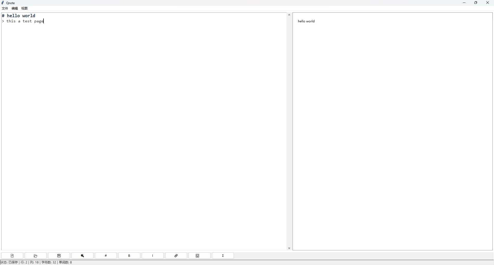

# Qnote - 轻量级Markdown编辑器

[中文](README.md)
[English](README_EN.md)


 


Qnote 是一个基于 Python Tkinter 开发的现代化 Markdown 编辑器，支持实时预览、语法高亮和多种实用功能，适合日常笔记记录和技术文档编写。

## 功能特性

- **实时双栏预览**：左侧编辑，右侧即时呈现渲染效果
- **智能语法高亮**：自动识别并高亮显示：
  - 标题（#）
  - 加粗/斜体（** ** / * *)
  - 代码块（```）
  - 数学公式（$ $）
  - 超链接与图片
- **主题切换**：支持亮色/暗色模式
- **大纲视图**：自动生成文档结构导航
- **版本控制**：
  - 无限次撤销/重做（Ctrl+Z/Y）
  - 自动保存功能（每30秒）
- **便捷工具**：
  - 一键插入常用元素（标题/链接/图片等）
  - 查找替换功能（支持全局替换）
  - 字数统计与光标位置显示
- **格式导出**：完整HTML导出（含数学公式支持）

## 最近更新
- 新增英文版本
- 添加了预览功能
- 优化了代码结构
- 修复了一些bug

## 安装使用

### 环境要求
- Python 3.6+
- 依赖库：
  ```bash
  pip install markdown
  ```
  ## 启动方式

### 方法1
```bash
git clone https://github.com/Reoame/Qnote.git
cd Qnote
python qnote.py
```
### 方法2

在Release页面直接下载可执行程序

## 快捷键列表
功能	快捷键
新建文件	Ctrl + N
打开文件	Ctrl + O
保存文件	Ctrl + S
撤销操作	Ctrl + Z
重做操作	Ctrl + Y
重新打开文件	Ctrl + L
主题切换
通过菜单栏 视图 → 切换主题 或工具栏按钮可在亮/暗主题间切换：

亮色主题：适合日间使用

暗色主题：低蓝光护眼模式

导出HTML
点击 文件 → 导出HTML

选择保存路径

生成包含以下特性的完整HTML文件：

响应式布局

代码高亮

数学公式渲染（MathJax）

美观的排版样式

## 参与贡献
欢迎通过以下方式参与项目：

提交 Issue 报告问题

Fork 仓库并提交 Pull Request

完善文档或翻译

贡献指南

技术支持
遇到问题请联系：

作者：Reoame

GitHub: Reoame

邮箱：reoame_github@outlook.com

在项目仓库提交issues

## 接下来的计划

- 添加更多外语版本 


开源协议
本项目采用 MIT License

# Qnote - A Lightweight Markdown Editor

[中文](README.md)
[English](README_EN.md)
 

Qnote is a modern Markdown editor developed based on Python Tkinter. It supports real-time preview, syntax highlighting, and a variety of practical functions, making it suitable for daily note-taking and technical document writing.


## Features
Real-time Dual-pane Preview: Edit on the left and instantly see the rendered effect on the right.
Intelligent Syntax Highlighting: Automatically identify and highlight:
- Headings (#)
- Bold/Italic (** ** / * *)
- Code Blocks (```)
- Mathematical Formulas ($ $)
- Hyperlinks and Images

## Last update
- Added English version
- Added preview feature
- Optimized the code structure
- Fixed some bugs

**Theme Switching:**

Support for light/dark modes.
Outline View: Automatically generate a document structure navigation.

**Version Control:**

Unlimited Undo/Redo (Ctrl+Z/Y)
Automatic Save Function (every 30 seconds)
Convenient Tools:
Insert commonly used elements with one click (headings/links/images, etc.)
Find and Replace function (supports global replacement)
Word count and cursor position display
Format Export: Complete HTML export (with support for mathematical formulas)
Installation and Usage
Environment Requirements
Python 3.6+
Dependent Libraries:
```bash
pip install markdown
```
## Launch Methods
### Method 1
```bash
git clone https://github.com/Reoame/Qnote.git
cd Qnote
python qnote.py
```
### Method 2

Download the executable program directly from the Release page.

List of Shortcut Keys
Function Shortcut Key
- **New File Ctrl + N**
- **Open File Ctrl + O**
- **Save File Ctrl + S**
- **Undo Operation Ctrl + Z**
- **Redo Operation Ctrl + Y**
- **Reopen File Ctrl + L**

Open File Ctrl + O
Save File Ctrl + S
Undo Operation Ctrl + Z
Redo Operation Ctrl + Y
Reopen File Ctrl + L
Theme Switching
You can switch between light and dark themes through the menu bar View → Switch Theme or the toolbar button:
Light Theme: Suitable for daytime use.
Dark Theme: Low blue light eye protection mode.
Export HTML
Click File → Export HTML
Select the save path.
Generate a complete HTML file with the following features:
Responsive layout
Code highlighting
Mathematical formula rendering (MathJax)
Beautiful
Contribute
## You are welcome to participate in the project in the following ways:
Submit Issues to report problems.
Fork the repository and submit Pull Requests.
Improve the documentation or translations.
Contribution Guidelines
Technical Support
If you encounter any problems, please contact:
Author: Reoame

GitHub: Reoame

Email: reoame_github@outlook.com

Submit issues in the project repository.
## Future Plans
Add more language versions.
Open Source License
This project is licensed under the MIT License.